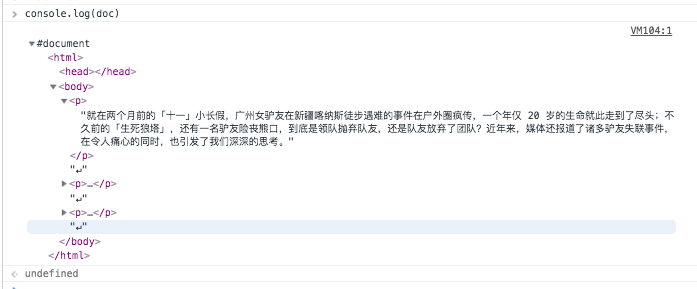
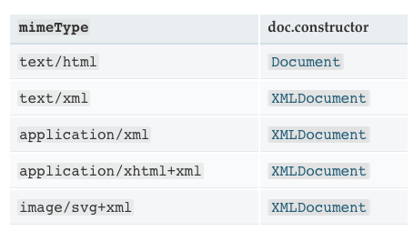

# js-Base  
## Object  
## 数组
1. Array.isArray(obj)判断传入的对象是否为数组。
	```js
	// 下面的函数调用都返回 true
	Array.isArray([]);
	Array.isArray([1]);
	Array.isArray(new Array());
	// 鲜为人知的事实：其实 Array.prototype 也是一个数组。
	Array.isArray(Array.prototype);
	```
	若Array.isArray()不存在，实现方法：
	```js
	Array.isArray = (arg) => Object.prototype.toString.call(arg) === '[object Array]'
	```
2. 由new Array(3)或Array(3)创建的数组，创建一个长度为3的空数组（注意：这是指一个有3个空位的数组，而不是由3个undefined组成的数组）
	```js
	console.log(Array(3) == [undefined,undefined,undefined])
	//输出false
	```
3. Array.slice(begin,end)从 begin 到 end 的所有元素（包含begin，但不包含end），返回值还是数组。begin默认是从0开始，若无end值就从begin位置开始一直取到结束，若begin，end值为负数值得是倒数第几个数；若绝对值end小于等于begin则返回空数组；  
4. ```Array.toString()```和```Array.toLocaleString()```是有区别的，后者是返回一个字符串表示数组中的元素。数组中的元素将使用各自的 toLocaleString 方法转成字符串，这些字符串将使用一个特定语言环境的字符串（例如一个逗号 ","）隔开。
	```
	[1, 'a', new Date('21 Dec 1997 14:12:00 UTC')].toLocaleString()
	//"1,a,1997/12/21 下午10:12:00"
	[1, 'a', new Date('21 Dec 1997 14:12:00 UTC')].toString()
	//"1,a,Sun Dec 21 1997 22:12:00 GMT+0800 (中国标准时间)"
	```
## 函数
1. 函数的上下文是指:
	
	> 上下文又指函数的执行环境，JavaScript 中的函数既可以被当作普通函数执行，也可以作为对象的方法执行，这是导致 this 含义如此丰富的主要原因。一个函数被执行时，会创建一个执行环境（ExecutionContext），函数的所有的行为均发生在此执行环境中，构建该执行环境时，JavaScript 首先会创建 arguments变量，其中包含调用函数时传入的参数。接下来创建作用域链。然后初始化变量，首先初始化函数的形参表，值为 arguments变量中对应的值，如果 arguments变量中没有对应值，则该形参初始化为 undefined。如果该函数中含有内部函数，则初始化这些内部函数。如果没有，继续初始化该函数内定义的局部变量，需要注意的是此时这些变量初始化为 undefined，其赋值操作在执行环境（ExecutionContext）创建成功后，函数执行时才会执行，这点对于我们理解 JavaScript 中的变量作用域非常重要，鉴于篇幅，我们先不在这里讨论这个话题。最后为 this变量赋值，如前所述，会根据函数调用方式的不同，赋给 this全局对象，当前对象等。至此函数的执行环境（ExecutionContext）创建成功，函数开始逐行执行，所需变量均从之前构建好的执行环境（ExecutionContext）中读取。
## Other
1. typeof有的几种类型：undefined，function，boolean，number，string，Symbol，object；  
	**注意事项**：
	```
	typeof null === 'object';
	typeof new Boolean(true) === 'object';
	typeof Boolean(true) === 'boolean';
	typeof new Number(1) === 'object';
	typeof Number(1) === 'number';
	typeof new String("abc") === 'object';
	typeof String("abc") === 'string';
	typeof new Function() === 'function';
	typeof class C{} === 'function'；  
	typeof /\s/ === "function";
	typeof document.all === "undefined"
	```
2. require和import的区别：  
3. querySelectorAll 方法相比 getElementsBy 系列方法有什么区别？
	> **1.W3C的标准**
		querySelectorAll 属于 W3C 中的 Selectors API 规范 [1]。而 getElementsBy 系列则属于 W3C 的 DOM 规范 [2]。  
	  **2.浏览器兼容**  
		querySelectorAll 已被 IE 8+、FF 3.5+、Safari 3.1+、Chrome 和 Opera 10+ 良好支持 。getElementsBy 系列，以最迟添加到规范中的 getElementsByClassName 为例，IE 9+、FF 3 +、Safari 3.1+、Chrome 和 Opera 9+ 都已经支持该方法了。  
	  **3.接收参数**  
		querySelectorAll 方法接收的参数是一个 CSS 选择符。而 getElementsBy 系列接收的参数只能是单一的className、tagName 和 name。代码如下 [3]：  
		```
		var c1 = document.querySelectorAll('.b1 .c');
		var c2 = document.getElementsByClassName('c');
		var c3 = document.getElementsByClassName('b2')[0].getElementsByClassName('c');  
		```
		需要注意的是，querySelectorAll 所接收的参数是必须严格符合 CSS 选择符规范的。所以下面这种写法，将会抛出异常。代码如下 [4]：  
		```  
		try {
		  var e1 = document.getElementsByClassName('1a2b3c');
		  var e2 = document.querySelectorAll('.1a2b3c');
		} catch (e) {
		  console.error(e.message);
		}
		console.log(e1 && e1[0].className);
		console.log(e2 && e2[0].className);  
		​``` .   
		**4. 返回值**  
		querySelectorAll 返回的是一个 Static Node List，而 getElementsBy 系列的返回的是一个 Live Node List。
		例子：  
		```
		// Demo 1
		var ul = document.querySelectorAll('ul')[0],
			lis = ul.querySelectorAll("li");
		for(var i = 0; i < lis.length ; i++){
			ul.appendChild(document.createElement("li"));
		}
		// Demo 2
		var ul = document.getElementsByTagName('ul')[0], 
			lis = ul.getElementsByTagName("li"); 
		for(var i = 0; i < lis.length ; i++){
			ul.appendChild(document.createElement("li")); 
		}  
		```  
		因为 Demo 2 中的 lis 是一个动态的 Node List， 每一次调用 lis 都会重新对文档进行查询，导致无限循环的问题。而 Demo 1 中的 lis 是一个静态的 Node List，是一个 li 集合的快照，对文档的任何操作都不会对其产生影响。  
		```
4. Intersection Observer API.[MDN 介绍](https://developer.mozilla.org/zh-CN/docs/Web/API/Intersection_Observer_API) 
	> 提供了一种异步观察目标元素与祖先元素或顶级文档viewport的交集中的变化的方法。  

	**用途**：对特定元素的埋点、是图片懒加载、无限加载列表等需求，大大提升页面性能。  
	**注意事项**：  
	(1) 这个 API 并不能提供两个元素的重叠部分的准确像素个数，只能在相交到一定百分比后，触发一个 Callback；  
	(2) 触发 Callback 的百分比阀值由 **threshold** 来确定，0-1.0 之间取值，既可以传一个数字，也可以传一个数组；  
	(3) Callback 会在主线程中执行，故最好不要执行一些耗时较长的操作，或者使用 Window.requestIdleCallback()；  
	(4) 如果元素是不规则的图形也将会被看成一个包含元素所有区域的最小矩形;  
	(5) [Can I use](https://caniuse.com/#search=IntersectionObserver) 上目前（2019.09.25）是 89.3% 浏览器都支持；  
5. iOS 滚动条的「回弹」效果，window.scrollY || window.pageYOffset 的值为负数；  
6. **Infinity**, 表示一个无穷大的数字，是一个全局变量。  
	```
	console.log(Math.pow(10, 10000))  // Infinity   
	console.log(Math.log(0))  // -Infinity
	Math.pow(10, 10000) === Infinity  // true  
	Infinity/Infinity  // NaN  
	54325435/Infinity  // 0  
	```
7. **EventTarget.addEventListener()** 的第三个参数。在「红宝石」书中，这个方法的第三个参数接受的是一个布尔值，如今在新版本的 DOM 的规定中，第三个参数可以接受一个可选配置对象。除了控制回调函数触发的事件流阶段的功能以外，增加了**「控制回调函数是否只执行一次」**、「**回调函数中是否可以使用 preventDefault()**」的两个配置项，具体细节「[MDN](https://developer.mozilla.org/zh-CN/docs/Web/API/EventTarget/addEventListener)」  
8. **isFinite()** 这是 Javascript 标准内置的一个方法, 几乎所有主流的浏览器都支持该方法，它用来判断是个数是否是*有限数*（非无穷数），它接受一个参数，该参数在非 number 类型的情况下会强制类型转换成 number 类型，该方法返回一个布尔值。  
	```  js
	isFinite(NaN); // false  
	isFinite('string'); // false, Number('string') 的结果是 NaN  
	isFinite(1000/0); // false  
	isFinite(34); // true
	isFinite(0); // true  
	isFinite(false); // true  
	```  
9. **DOMParser** 对象，MDN 上的定义：
	> DOMParser 可以将存储在字符串中的 XML 或 HTML 源代码解析为一个 DOM Document。  
	  
	将字符串转换成 DOM 对象，是通过 DOMParser 实例的 ```parseFromString()``` 方法来实现的，一个 🌰 ：  
	```js
	let parser = new DOMParser()
	let doc = parser.parseFromString("<p>就在两个月前的「十一」小长假，广州女驴友在新疆喀纳斯徒步遇难的事件在户外圈疯传，一个年仅 20 岁的生命就此走到了尽头；不久前的「生死狼塔」，还有一名驴友险丧熊口，到底是领队抛弃队友，还是队友放弃了团队？近年来，媒体还报道了诸多驴友失联事件，在令人痛心的同时，也引发了我们深深的思考。</p>↵<p>记得我第一次接触户外的时候，是在不清楚情形的状况下进行的，团队由青旅的驴友组成。临行前，临时领队让我去换装备，而我却固执地不听劝导，依然我行我素，穿着裙子、凉鞋，还带着单反，后果可想而知……</p>↵<p>没想到的是，刚进入森林地段，临时领队因不满队友的行进速度抛下队友，独自前行，被他抛下的几个毫无经验的小姑娘，在雨天的高原上迷失了方向，情况岌岌可危。至今我还记得当时的慌乱：大雾之中难辨方向，雨水和着汗水让浑身湿透，还有黑夜的步步逼近……最可恨的是，我当初不听劝告而执意穿上的裙子和凉鞋，此时严重地阻挡了前进的步伐。在无奈和恐惧之中，我也难再顾及其他，只能滚着、爬着，在泥水中、悬崖上寻找出路。</p>↵", 'text/html')
	```
	    
	  
	parseFromString() 方法的第一个参数是需转换的 DOMstring，第二个参数是该返返回对象的 mimeType 类型，可以是以下几种:  
	  
	  
	当然可以使用 [XMLSerializer.serializeToString()](https://developer.mozilla.org/en-US/docs/Web/API/XMLSerializer/serializeToString) 进行逆向操作，即将 DOM 对象转换层 DOMString。   
	有什么作用呢？比如：在富文本渲染时，想对富文本内容进行修改，通过字符串匹配太麻烦，就可以先将其转成 DOM 对象，再进行操作～([can i use](https://caniuse.com/#search=DOMParser) 上看，国内浏览器貌似不怎么支持....)

