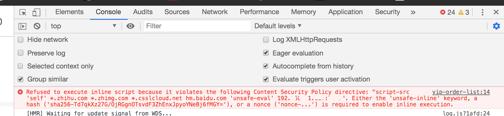

## WEB 安全 -- CSP

前段时间在做项目页面性能统计时，需要在 html 中嵌入一段 js 脚本，原本以为只要加个 script 标签，写上对应的 js 即可，当我写好代码准备调试时，控制台抛出了个异常...
 
原来我们项目使用 CSP 来做了一层安全保护，所以不能直接插入没有“安全标识“的内嵌脚本，那 CSP 到底是什么？它是如何保护我们网页？怎么在项目中使用它呢？

### 什么是 CSP（Content Security Policy）
CSP 直译为「内容安全策略」，它是由 w3c 提出来用于保证 web 站点内容安全的一种机制，定义中的「内容」不仅仅指的是 js 脚本内容，还包含了像网站中的图片、多媒体、样式等资源内容。网站维护者用它去定义一些内容来源的规则，然后它将这些规则告诉浏览器，浏览器根据这些规则来判定哪些内容是安全的，可以使用的，不在规定来源的内容则会统统失效。

### CSP 作用及原理  
CSP 通过设定安全的 web 内容域，来阻止非法脚本的执行，从本质上消除了 XSS 攻击的可能。举一个最简单的 XSS 攻击，用户通过表单提交一段恶意的 js 脚本，web 站点的后端程序并未对非法字符进行过滤，当其他用户访问该站点时，就会遭殃，倘若使用了 CSP ，这段脚本由于并非来自网站管理者指定的有效域，所以将不被执行。 CSP 除了可以设定内容有效域之外，还可以指定哪种协议是可以被使用的，比如你可以指定所有 web 内容必须通过 https 来加载，这样就可以一定程度上减少网站遭受[数据包嗅探攻击](https://blog.csdn.net/tangCprogranm/article/details/84558652)。  

### 如何开启 CSP
在你网站中使用 CSP 其实很简单，有两种开启方式：
1. 通过 ```<meta>``` 标签来开启 CSP 的配置;   
``` <meta http-equiv="Content-Security-Policy" content="default-src 'self'; img-src https://*;"> ```  
2. 通过返回 Content-Security-Policy 这个 HTTP Header 即可，这个 Header 对应的值就是我们 web 内容来源的规则;  
   

### 如何编写“规则”  
这些规则定义了 web 内容的来源是否合法，它是由一系列 CSP 的指令组合而成，组合格式如同上文的 meta 标签所示，每个指令用 ```;``` 进行分隔。比如上面示例中用到的```img-src https://*;``` ,它指定了我们网页中的图片来源地址必须是用 https 协议的。下面列举一些较为常用的指令：
+ **script-src** 这个指令规定了网站中可执行脚本的来源，同时也控制了 [XSLT](https://developer.mozilla.org/zh-CN/docs/Web/XSLT) 的来源。
+ **style-src** 定义了样式文件的来源。
+ **img-src** 规定了网站中的图片的来源。
+ **media-src** 规定了富媒体（音视频、[视频文本轨格式](https://developer.mozilla.org/zh-CN/docs/Web/API/WebVTT_API)）资源的来源。
+ **child-src** 规定了像 worker 、frame 这种嵌入可使用的链接。
+ **font-src** 规定了字体的来源，如果在网页中使用了第三方字体可以使用这个指令。
+ **form-action** 规定了网页中的 ```form``` 元素 ```action``` 的可提交地址。
+ **connect-src** 规定了脚本中发起连接的地址，像 XMLHttpRequest 的 send 方法、WebSocket连接地址、EventSource 等
+ **frame-src** 这个指令规定了 frame 的可使用链接。在 CSP level 2 中废弃了，文档中叫我们用 child-src 来代替这个指令，但在 level 3 中恢复使用。
+ **object-src** 规定了一些插件的来源，像 Flash 等。
+ **report-uri** 这个指令是指定一个 CSP 上报地址，当浏览器检测到有不通过指令时，将通过这个指定地址进行上报。值得注意的是，这个指令不能在 meta 元素中使用，并且在 CSP level3 中这个指令会被废弃，用 report-to 来代替，为了保证这个指令有效，官方推荐 report-uri & report-to 同时使用。
+ **worker-src** 这个指令是 CSP level3 中加的，规定了 Worker、SharedWorker、serviceWorker 中可用的地址。
+ **base-uri** 规定了页面 ```base``` 标签中的链接。
+ **frame-ancestors** 规定了当前的页面可以被哪些来源所嵌入。作用于 ```<frame>, <iframe>, <embed>, <applet>```。该指令不能通过 ```<meta>```指定且只对非 HTML 文档类型的资源生效。  

对于上面这些指令，w3c 也给他们设定了一些预设值，来完成一些基础场景的指令配置：

+ self 这个值代表指令的来源只匹配当前域，不包括子域。比如 example.com 可以，api.example.com 则会匹配失败。
+ none 指令为这个值的时候，则不匹配任何东西。例如:  
 ```Content-Security-Policy: script-src https://cdn.example.com/scripts/; object-src 'none'```  
 这个例子则表示网页中没有插件可以执行。
+ unsafe-inline 该值表示允许内嵌的脚本、样式。直接用这个感觉很粗糙，下面会提到更为安全的内嵌脚本、样式定义方法。
+ unsafe-eval 代表相应指令的源允许通过字符串动态创建的脚本执行，像 eval、setTimeout 等。  

对于内联的脚本或者样式，即用 ```script``` 标签或者 ```style``` 标签内嵌到 HTML 的内容，CSP 也给了限制规则，就是在对应的 script 、style 标签上加一个 nonce 属性，并赋一个加密串，然后在页面的响应头 ```Content-Security-Policy``` 中加上这个加密串即可，确保每次请求页面时，加密串是不一样的，不然会让网站攻击者有可乘之机，下面是一个内嵌脚本的例子：  
```js
// 内嵌到 HTML 的脚本
<script nonce='e1f5e9ea-4765-4bf3-bd0a-5c6ab622d375'>
  ...
</script>

// 相应头
Content-Security-Policy: script-src 'self' 'nonce-e1f5e9ea-4765-4bf3-bd0a-5c6ab622d375' hm.baidu.com zz.bdstatic.com www.googletagmanager.com;
```  
指的注意的是 **nonce 和 上面提到的预设值需要用 ```''``` 单引号包裹起来才能生效。**  

### 一个 🌰 分析
```
Content-Security-Policy: img-src *; connect-src * wss: blob:; frame-src 'self' *.zhihu.com weixin:; script-src 'self' *.zhihu.com 'nonce-e1f5e9ea-4765-4bf3-bd0a-5c6ab622d375'; style-src 'self' 'unsafe-inline'
```
这个例子中规定了：
1. 图片可以是任意来源的；
2. 网站中发起连接的地址可以是 wss 或则 blob 协议的；
3. 内嵌的 iframe 内容必须是来自站点的同一个源，或者是 ```*.zhihu.com```、```weixin：``` 域名协议下；
4. 脚本内容必须自站点的同一个源，或者 ```*.zhihu.com```域下，或者是 nonce 属性为 ```e1f5e9ea-4765-4bf3-bd0a-5c6ab622d375``` 的内嵌脚本；
5. 样式内容必须自站点的同一个源，而且支持在 HTML 中通过 style 标签引入内嵌样式内容；  

### 总结
以上就是 CSP 的基本使用，CSP 还有错误上报等一些辅助功能，这里就不一一介绍了。w3c 提出这个机制，目的是为了更好的保护我们的网站，个人认为在中大型项目中很有必要引入 CSP，引入成本不高，但它能在网站安全上给你极大信心。当然对于 Web 安全来说是没有绝对安全的，只有降低其遭受攻击的风险。


#### 参考
[Content Security Policy Level 3](https://www.w3.org/TR/CSP3/)  
[Content Security Policy Level 2](https://www.w3.org/TR/CSP2/)  
[内容安全策略( CSP )](https://developer.mozilla.org/zh-CN/docs/Web/HTTP/CSP)