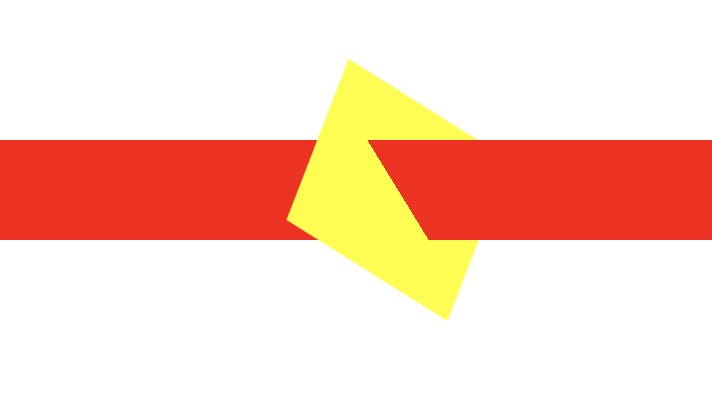
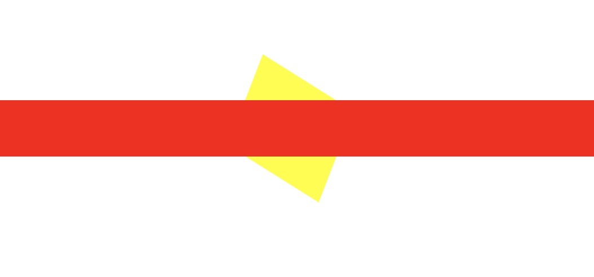

# CSS 碎碎念
## GET 新技能
1. **什么是 BFC**（Block Formating Context）：BFC 相当于提供了一个独立布局的环境，里面的元素都遵循同一套布局规则，相邻的元素一个个挨着排列，可以用 margin-left | right 来控制其间距，并且在 bfc 中垂直方向的 margin 会重叠。而 float 和 clear float 也只对同一个 BFC 内的元素有效。  
   **什么情况下会产生 BFC**： （官方）非块级盒子的浮动元素、绝对定位元素及块级容器(比如 inline-blocks、table-cells 和 table-captions)，以及 overflow 属性是 visible 之外任意值的块级盒子，都会创建了一个 BFC。所以只要 css 中设置了以下元素就会产生 BFC：  
	+ float：left|right
	+ position：absolute|fixed
	+ display: table-cell|table-caption|inline-block
	+ overflow: hidden|scroll|auto  
2. **word-break** 属性： 指定了怎样在单词内断行。([MDN介绍](https://developer.mozilla.org/zh-CN/docs/Web/CSS/word-break))  
如果没有设置`word-break`属性，该元素实现了单行省略，且文本中包括「长破折号」、「连续多个等于号」或 non-CJK (CJK 指中文/日文/韩文) 文本，这该单行省略可能会出现异常，解决办法就是设置`word-break`属性。（例子：https://codepen.io/yeejone/pen/zYOdRXY）  
3. **pointer-events** 属性：*指定在什么情况下 (如果有) 某个特定的图形元素可以成为鼠标事件的 target* 
该属性的大部分是和 SVG 相关的，具体可移步 [MDN](https://developer.mozilla.org/zh-CN/docs/Web/CSS/pointer-events)。 这边主要关注 ```pointer-events：none``` 的一些表现和实际应用。🌰：[CodePen](https://codepen.io/yeejone/pen/gOYEMab)  
	+ 当该属性值为 ```none``` 时，则该元素将不接受所有鼠标事件；
	+ 该属性设为 ```none```，则该元素在页面上的表现相当于一个带有样式的'水印'，它会造成点击穿透；   
4. **filter** 属性：可以通过设定相关「效果函数」，来改变页面中的一些图片展示效果。  
	> 「效果函数」：   
	[blur()](https://developer.mozilla.org/en-US/docs/Web/CSS/filter-function/blur)--高斯模糊、「毛玻璃」效果，默认值：0  
	[brightness()](https://developer.mozilla.org/en-US/docs/Web/CSS/filter-function/brightness)--调整图片的亮度，小于 1 在原图基础上变暗；大于 1 则变亮 默认值：1  
	[contrast()](https://developer.mozilla.org/en-US/docs/Web/CSS/filter-function/contrast)--调整图片的对对比度，规则与 brightness() 一样，默认值：1  
	[drop-shadow()](https://developer.mozilla.org/en-US/docs/Web/CSS/filter-function/drop-shadow)--增强版图像的「*box-shadow*」,可以依据图片的形状来增加阴影  
	[grayscale()](https://developer.mozilla.org/en-US/docs/Web/CSS/filter-function/grayscale)--改变图片的灰度，默认值：0  
	[hue-rotate()](https://developer.mozilla.org/en-US/docs/Web/CSS/filter-function/hue-rotate)--转换图片的色调，默认值：0  
	[invert()](https://developer.mozilla.org/en-US/docs/Web/CSS/filter-function/invert)--反转图像的颜色，默认值：0  
	[opacity()](https://developer.mozilla.org/en-US/docs/Web/CSS/filter-function/opacity)--和 *opacity* 属性作用、用法一样，特殊的是有部分浏览器在 fiter：opacity() 时会启动硬件加速，默认值：1  
	[saturate()](https://developer.mozilla.org/en-US/docs/Web/CSS/filter-function/saturate)--调整图像的饱和度，默认值：1  
	[sepia()](https://developer.mozilla.org/en-US/docs/Web/CSS/filter-function/sepia)--将图像跳成「土豪金」的色调，默认值：0  
	
## Attention Point
1. 浏览器渲染页面的过程：[页面渲染](https://coolshell.cn/articles/9666.html);
   
   > 总结：从上面的页面渲染过程可以得出为什么 css3 的动画性能比 jquery 或 js 写的动画效果性能好----因为页面渲染的流程可简单概括为以下几步：1.根据html 文件构建 DOM tree；2.根据样式表、计算 CSS 样式构建 CSS Rule Tree；3.由 DOM tree 和 CSS Rule Tree 构建 render tree；4.最后通过调用操作系统 Native GUI 的 API 绘制；**那么如果使用 js 或 jquery 实现动画必然会涉及到动态修改了 DOM 属性或是 CSS 属性，这样就会导致重新执行 1 或 2、3 步骤，这些过程很耗性能（构建 render tree 要比对 dom 节点并对相应的节点使用匹配的样式规则，所以 DOM 树要小，CSS 尽量用 id 和 class，千万不要过渡层叠下去）**   
2. Safari 使用 rotate3d 问题  
*问题：*  当元素使用 rotate3d，并在 Z 轴方向有转动角度时，则 safari 浏览器渲染会直接忽略 z-index 属性.   
*现象：*  safari 浏览器：   Chrome 浏览器：（[示例代码](https://github.com/YeeJone/Fill-the-pit-do-again-/blob/master/rotate3d-safari.html)）.   
*解决方案：*   
(1) 使应用 rotate3d 的元素变成 BFC ，最简单的方式是在其单独块的父元素加上：`overflow: hidden`;  
(2) 在背影响的元素（图中红色块）上设置 translateZ ；  
*原理：*  **待补充文章...**  
3. iOS 中 input 样式错乱问题  
*原因：*  iOS 的个别类型（如：type='search' 等）的 input 会自带上一些类似` -webkit-appearance: searchfield; `等额外的属性，导致样式错乱。  
*解决方法：* 在对应的 input 元素的 css 下将这些额外加上的属性恢复默认值（` -webkit-appearance: none; `）  
4. translate 属性控制的元素偏移并不会影响其他元素的布局；在一个特定大小的父容器中如果使用 **translate 控制子元素偏移出父容器范围**，且父容器 overflow：scroll，则会**触发滚动条**。
