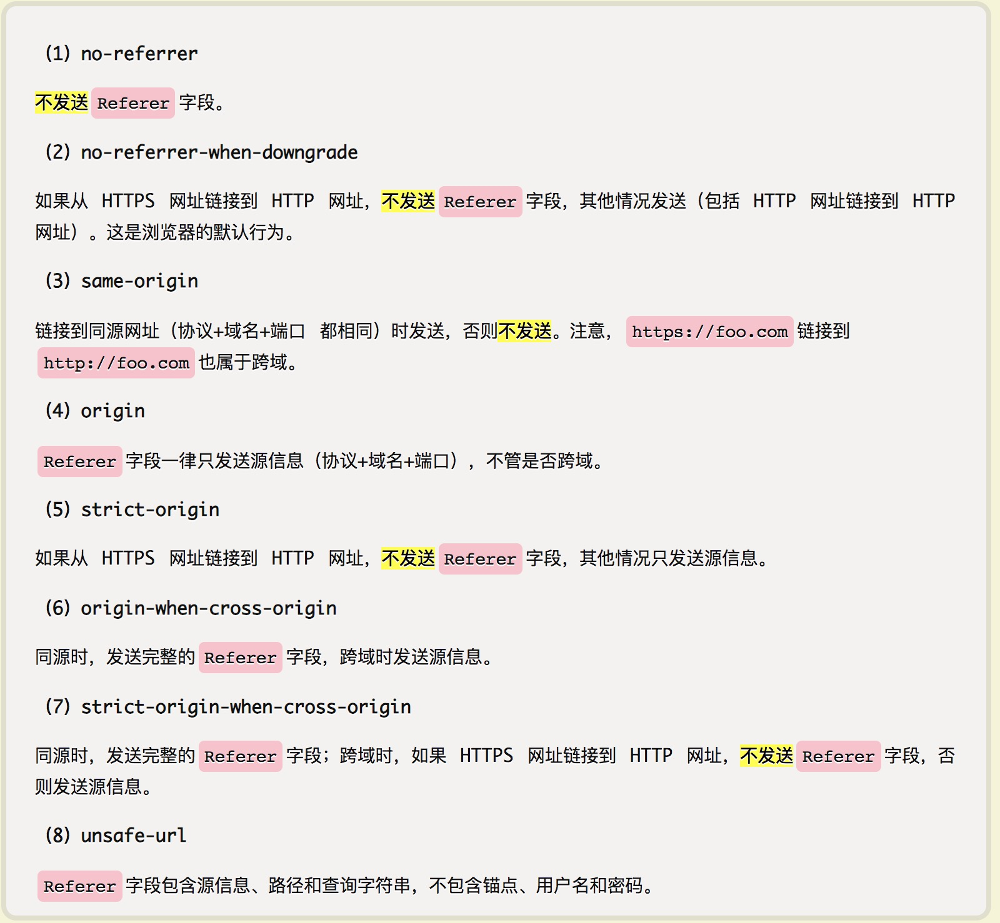

# 你不知道的HTML
## GET新技能  
1. **```<progress>``` 元素**  
	**定义**：该标签用来显示一项任务的完成进度，具体显示为一个进度条, 内联元素。  
	**属性**：progress 元素支持 HTML 中的全局属性，而且支持两个额外属性(number)：  
	+ ```max``` - 用来标识完成进度总的「工作量」，当不设置这个值时，默认值是 1；
	+ ```value``` - 用来标识当前状态已完成的「工作量」，它必须大于等于零，且小于 max 的值；     

	**样式**：对于 progress 元素的渲染，每个浏览器产商实现方式有差异，所以默认样式各个浏览器不一样。关于 progress 元素样式有几个关键的点：  
	+ 可以使用 ```:not([value])``` 与 ```[value]``` 来给没有 value 值和 有 value 值的 progress 元素分别设置样式；  
	+ ```appearance``` (不同浏览器需要加上前缀)设置成 ```none```, 可以重置浏览器默认样式。浏览器中的 progress 元素，其 appearance 属性的默认值为 ```progress-bar```，用来给 progress 元素一个默认样式；  
	+ 在谷歌/safari 等 WebKit/Blink 内核的浏览器中，```-webkit-progress-bar``` 用来设置 progress 元素 bar 的样式，然而 Firefox 用 ```-moz-progress-bar``` 来设置**已完成 bar** 的样式，与谷歌浏览器完全相反， 而且 Firefox 不支持设置全部进度 bar 的样式;
	+ ```-webkit-progress-value``` 用来设置已完成 bar 的样式；  
	+ ```-webkit-progress-value``` & ```-webkit-progress-bar``` 都支持伪元素，但 ```-moz-progress-bar``` 不支持；
  
	**兼容性**：[Can I use](https://caniuse.com/#search=progress) 98% 以上的浏览器都支持。和 video 元素一样，如果浏览器不支持该元素，可以在标签之间实现一个 fallback 方案，或者友好提示：  
	```html
	<progress max="100" value="80">
	  <div class="progress-bar">
	    <span style="width: 80%;">如果浏览器不支持该元素，就会看到这行文字</span>
	  </div>
	</progress>
	```  
	[相关示例代码](https://codepen.io/yeejone/pen/MWyyqoO)

	
## Attention Point
1. option中a标签是无效的，若要在select的选项中给相关的链接，通过option的value属性，与a标签效果是一样的，例:  
```<select><option value="http：//xxx">aaa</option></select>;```
2. localstorage 的 value 只能为字符串，若要存取对象的话需要将对象转换成 json 字符串，若对象是自定义对象或 Map 之类的要先转成 json 对象再转成 json 字符串；
3. script 标签的 defer 和 async 属性：
	> defer这个属性的用途让脚本在整个页面都解析后执行，因此 ```<script>``` 元素设置 defer 属性，相当于告诉浏览器先下载好脚本，但要延迟执行;  
	HTML5规范要求脚本按照它们出现的先后顺序执行，因此第一个延迟脚本会先于第二个延迟脚本执行，而这两个脚本会先于 DOMContentLoaded 事件执行。在现实当中，延迟脚本并不一定会按照顺序执行，也不一定会在 DOMContentLoad 时间触发前执行，因此最好只包含一个延迟脚本。  
	
	> async 这个属性与defer类似，都用于改变处理脚本的行为。同样与 defer 类似，async 只适用于外部脚本文件，并告诉浏览器立即下载文件。但与 defer 不同的是，标记为 async 的脚本并不保证按照它们的先后顺序执行。第二个脚本文件可能会在第一个脚本文件之前执行。因此确保两者之间互不依赖非常重要。指定 async 属性的目的是不让页面等待两个脚本下载和执行，从而异步加载页面其他内容。
4. p标签内是无法包裹块级元素的，很多浏览器把 body 视为一级，一部分块级元素视为二级，而有一部分不能自由嵌套的块级元素则被视为三级，它们包括有：标题标记 的 h1- h6、 caption ； 段落标记的 p ；分隔线 hr 和一个特别的元素 dt (它只存在于列表元素 dl 中)。  
	三级元素就是指，只能嵌套内联元素的块级元素。 p 也恰好是其中之一。其实在内联元素中，还是可以再区分一下的，有几个元素 （img、input 等）比较特别，它们可以定义宽高，虽然这些元素属于 inline，但是却具有一定的 block（可以设置宽高），我们也可以赋予任何元素 css 属性 display:inline-block。   
5. video 标签，在 iphone 上 video 标签使用 playsinline 属性可以在线播放，并且播放开始时**不会自动进入全屏模式**。（iOS 12及以上有效，iOS8、iOS9无效）  
6. **document.referrer 介绍及理解**  document 对象有个 referrer 属性，它的值是上一个访问过页面的 url 。在有「返回上一页」的需求时，对这个属性做个判空处理用户体验更好。以下情况下 document.referrer 的值为空：    
	> + 无上一个访问过的页面，如直接在地址栏输入地址访问的网页它的值为空字符串；  
	> + 通过 rel="noreferrer" 的 a 标签跳转的网页；  
	> + 网页中设置了 ```<meta content="never" name="referrer">``` 的网页；  
	> + 「Referrer Policy」可以设置网页是否设置 referrer 的值, 社区的前辈已经总结：  

	其实与之对应的是 HTTP 协议在请求（request）的头信息里的「Referer」 字段，给出了上一个访问页面的 URL。（详情见：http://www.ruanyifeng.com/blog/2019/06/http-referer.html）。  
